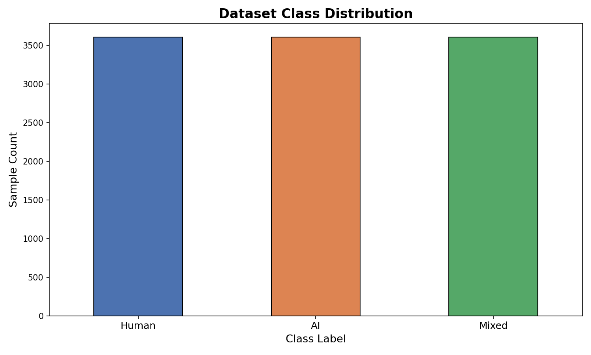
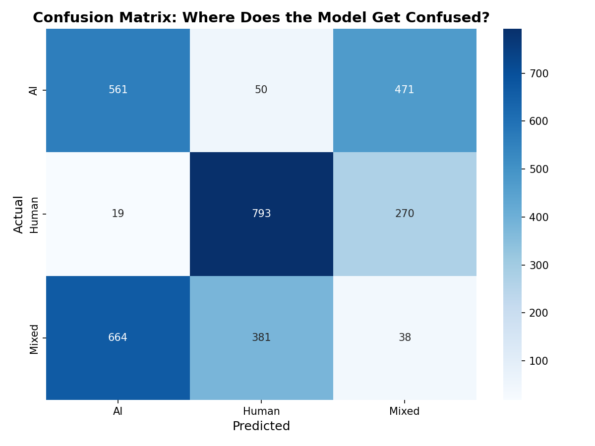
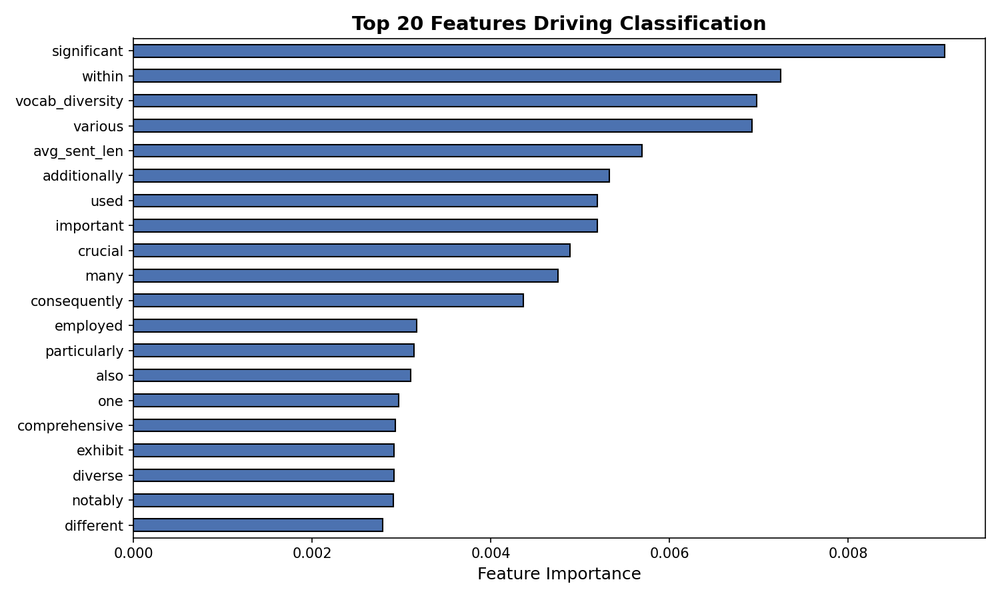

<p align="center">
  <h1 align="center">🔬 AIGTxt — Scientific Text Classification Pipeline</h1>
  <p align="center">
    <em>Detecting AI-Generated, Human-Written, and Mixed Scientific Text using Classical NLP & Machine Learning</em>
  </p>
  <p align="center">
    
    
    
    
  </p>
</p>

---

## 📖 Abstract

With the rapid proliferation of Large Language Models (LLMs) such as ChatGPT in academic and scientific writing, the ability to automatically distinguish between **human-authored**, **AI-generated**, and **mixed** (human + AI) text has become a pressing concern for academic integrity, peer review, and content verification.

This project presents an end-to-end machine learning pipeline for **three-class scientific text classification**. Using the **AIGTxt** dataset—a curated collection of scientific passages spanning multiple academic domains—we engineer linguistic features, apply **TF-IDF vectorization** with bigram support, and compare two interpretable classifiers: **Multinomial Naive Bayes** (baseline) and **Random Forest** (ensemble). Our analysis includes detailed **error diagnostics** and **feature importance** interpretation to understand _why_ models succeed or fail on this challenging task.

---

## 📂 Repository Structure

```
AIGTxt/
├── data/
│   └── AIGTxt.xlsx            # Source dataset (Excel)
├── docs/
│   └── images/                # Visualizations for README
│       ├── class_distribution.png
│       ├── confusion_matrix.png
│       └── feature_importance.png
├── notebooks/
│   └── AIGTxt_Classification_Pipeline.ipynb  # Full analysis notebook (pre-executed)
├── .gitignore
└── README.md
```

---

## 📊 The Dataset: AIGTxt

The **AIGTxt** dataset is an Excel-based collection of scientific text samples organized in a **wide format**, with each column representing a different text source:

| Column              | Description                                                   |
| ------------------- | ------------------------------------------------------------- |
| `Human-Generated`   | Passages written entirely by human researchers.               |
| `ChatGPT-Generated` | Passages generated entirely by ChatGPT (an LLM).              |
| `Mixed Text`        | Passages that blend human and AI authorship.                  |
| `Domain`            | The academic domain of the text (e.g., Physics, Biology, CS). |

### Data Reshaping: Wide → Long

Raw datasets are often not ML-ready. The AIGTxt dataset arrives in "wide" format, where each class has its own column. Our pipeline **melts** this into a "long" format suitable for supervised learning:

- **Feature column (`text`)**: The raw scientific passage.
- **Target column (`label`)**: One of `AI`, `Human`, or `Mixed`.

After reshaping and dropping empty rows, the working dataset contains **10,821 samples** across 3 balanced classes.

<p align="center">
  
</p>
<p align="center"><em>Figure 1: Distribution of text sources in the reshaped dataset.</em></p>

---

## 🧠 Methodology

### 1. Text Preprocessing & Feature Engineering

#### TF-IDF Vectorization

We convert raw text into numerical feature vectors using **Term Frequency–Inverse Document Frequency (TF-IDF)**:

$$\text{TF-IDF}(t, d) = \text{TF}(t, d) \times \log\left(\frac{N}{\text{DF}(t)}\right)$$

Where:

- **TF(t, d)**: Frequency of term _t_ in document _d_.
- **DF(t)**: Number of documents containing term _t_.
- **N**: Total number of documents.

**Configuration:**

- `max_features=10,000` — Limits the vocabulary to the top 10K most important terms.
- `ngram_range=(1, 2)` — Captures both unigrams (single words) and **bigrams** (two-word phrases like "neural network" or "deep learning"), which are critical for detecting domain-specific patterns.
- `stop_words='english'` — Removes common words (the, is, a…) that carry no discriminative signal.

#### Engineered Linguistic Features

Beyond raw word frequencies, we compute two **document-level** features that capture writing _style_:

| Feature           | Intuition                                                                                 |
| ----------------- | ----------------------------------------------------------------------------------------- | ------ | --- | ----- | -------------------------------------------------------- |
| `avg_sent_len`    | Average number of words per sentence. AI text tends toward uniform, mid-length sentences. |
| `vocab_diversity` | Ratio of unique words to total words (`                                                   | unique | /   | total | `). Human text typically shows higher lexical diversity. |

These are appended to the TF-IDF matrix to form the final feature set.

---

### 2. Model Selection & Training

We adopt a **comparative** approach, evaluating two models with fundamentally different learning paradigms:

#### Multinomial Naive Bayes (Baseline)

- **Type**: Probabilistic classifier based on Bayes' theorem.
- **Assumption**: Features (words) are conditionally independent given the class — the "naive" assumption.
- **Strengths**: Extremely fast, works well with high-dimensional sparse data (like TF-IDF).
- **Weakness**: The independence assumption is violated in natural language, limiting its ability to capture word interactions.

#### Random Forest (Interpretable Ensemble)

- **Type**: Ensemble of 200 decision trees, each trained on a bootstrapped sample of the data.
- **Hyperparameters**: `n_estimators=200`, `random_state=42`, `n_jobs=-1` (full parallelism).
- **Strengths**: Handles feature interactions naturally; provides built-in **feature importance** scores; robust to overfitting via bagging.
- **Weakness**: Slower to train than Naive Bayes; less interpretable than a single decision tree.

#### Evaluation Protocol

Both models are evaluated using **5-Fold Stratified Cross-Validation** on the training set (70%) to estimate generalization performance, then assessed on a held-out **test set (30%)** using:

- **Precision**: Of all samples predicted as class _C_, what fraction truly belongs to _C_?
- **Recall**: Of all actual class _C_ samples, what fraction did the model correctly identify?
- **F1-Score**: Harmonic mean of Precision and Recall — balances both concerns.

---

## 📈 Results & Analysis

### Comparative Model Performance

| Metric            | Naive Bayes | Random Forest |
| ----------------- | :---------: | :-----------: |
| **CV Accuracy**   |    ~0.39    |     ~0.44     |
| **Test Accuracy** |    ~0.39    |     ~0.44     |

The **Random Forest** consistently outperforms Naive Bayes, leveraging its ability to capture non-linear feature interactions that the independence-assuming NB model cannot.

### Confusion Matrix

The confusion matrix reveals _where_ the model gets confused:

<p align="center">
  
</p>
<p align="center"><em>Figure 2: Confusion matrix for the Random Forest classifier on the test set.</em></p>

**Key observations:**

- **Human vs. AI** classification is reasonably strong (F1 ~0.52 for AI, ~0.67 for Human).
- **The `Mixed` class** is the primary source of error, with an F1-score of only **~0.05**.

### The "Mixed" Class Challenge

The `Mixed` class represents text that blends human and AI authorship. This creates a fundamental ambiguity for bag-of-words models:

> **Insight:** Mixed text _interpolates_ between AI and Human stylistic patterns. It lacks unique "anchor" words that exclusively signal the Mixed class, causing the model to frequently misclassify Mixed samples as either AI or Human.

This is a well-known limitation of frequency-based methods. Addressing this challenge motivates the transition to **contextual embeddings** (e.g., Transformers) in future work.

---

### Feature Importance

One of the key advantages of Random Forest is its ability to rank features by their contribution to classification decisions:

<p align="center">
  
</p>
<p align="center"><em>Figure 3: Top 20 features driving classification, ranked by Random Forest importance.</em></p>

**Notable findings:**

- **`vocab_diversity`** ranks as the **#1 most important feature**, confirming the hypothesis that lexical diversity is a strong stylistic discriminator between human and AI text.
- **`avg_sent_len`** also ranks highly (top 10), reinforcing that sentence-level structure carries discriminative signal.
- Domain-specific bigrams and technical terms (e.g., function words, scientific phrases) appear among the top features, reflecting the scientific nature of the dataset.

---

## 🔍 Error Analysis & Diagnostic Hypotheses

Beyond aggregate metrics, we examine individual misclassifications to generate **diagnostic hypotheses**:

| True Label | Predicted | Diagnostic Hypothesis                                                                                                                    |
| :--------: | :-------: | ---------------------------------------------------------------------------------------------------------------------------------------- |
|     AI     |   Human   | This AI text may exhibit higher lexical diversity or stylistic variation than typical LLM outputs, causing it to resemble human writing. |
|   Human    |    AI     | This human text may use overly technical, rigid academic structures that are characteristic of AI-generated prose.                       |
|   Mixed    | AI/Human  | Mixed text blends features from both classes, creating overlap in the feature space that bag-of-words models cannot resolve.             |

> **Takeaway:** The boundary between AI and Human text in scientific writing is not a clean line — it is a _gradient_. Models that rely solely on surface-level word statistics will struggle with texts near this boundary.

---

## ⚙️ Setup & Reproduction

### Prerequisites

- **Python 3.10+**
- A virtual environment is recommended.

### Installation

```bash
# 1. Clone the repository
git clone https://github.com/AdityaDotEnv/AIGTxt-Experiments.git
cd AIGTxt-Experiments

# 2. Create and activate a virtual environment
python -m venv .venv

# Windows
.venv\Scripts\activate

# macOS / Linux
source .venv/bin/activate

# 3. Install dependencies
pip install pandas numpy matplotlib seaborn scikit-learn nltk openpyxl nbformat nbclient nbconvert ipykernel scipy
```

### Running the Notebook

```bash
# Option A: Open in Jupyter / VS Code and run cell-by-cell
jupyter notebook notebooks/AIGTxt_Classification_Pipeline.ipynb

# Option B: Execute programmatically
jupyter nbconvert --to notebook --execute notebooks/AIGTxt_Classification_Pipeline.ipynb
```

The notebook is **pre-executed** — all outputs, plots, and classification reports are already embedded. You can view it directly on GitHub without running any code.

---

## 🔮 Future Work

1. **Transformer-based Models**: Fine-tuning **DistilBERT** or **SciBERT** on this dataset to leverage deep contextual (semantic) representations rather than surface-level word counts — expected to significantly improve Mixed class detection.
2. **Explainability**: Implementing **SHAP** (SHapley Additive exPlanations) or **LIME** for instance-level model explanations beyond aggregate feature importance.
3. **Data Augmentation**: Expanding the Mixed class with more diverse human-AI blended samples to improve recall.
4. **Cross-domain Generalization**: Testing whether a model trained on one academic domain (e.g., Physics) generalizes to another (e.g., Biology).

---

## 📚 Key Concepts Reference

<details>
<summary><strong>TF-IDF (Term Frequency–Inverse Document Frequency)</strong></summary>

A statistical measure that evaluates how important a word is to a document in a collection. Words that appear frequently in one document but rarely across the corpus receive high TF-IDF scores, making them strong discriminative features.

</details>

<details>
<summary><strong>N-Grams</strong></summary>

Contiguous sequences of _n_ items from a text. Unigrams (n=1) are individual words; bigrams (n=2) capture two-word phrases like "machine learning" or "neural network", preserving local word order information that unigrams alone lose.

</details>

<details>
<summary><strong>Stratified K-Fold Cross-Validation</strong></summary>

A model evaluation technique that splits the training data into K folds, ensuring each fold preserves the original class distribution. The model is trained on K-1 folds and tested on the remaining fold, rotating through all folds to produce a robust performance estimate.

</details>

<details>
<summary><strong>Random Forest</strong></summary>

An ensemble learning method that constructs multiple decision trees during training and outputs the mode of their predictions. Each tree is trained on a random subset of the data (bagging) and considers a random subset of features at each split, reducing variance and overfitting.

</details>

<details>
<summary><strong>Multinomial Naive Bayes</strong></summary>

A probabilistic classifier based on Bayes' theorem with the assumption that features are conditionally independent given the class label. Despite this "naive" assumption, it performs surprisingly well on text classification tasks, especially with TF-IDF features.

</details>

---

<p align="center">
  <em>Built as a scholarly exploration of AI text detection in scientific writing.</em>
</p>
